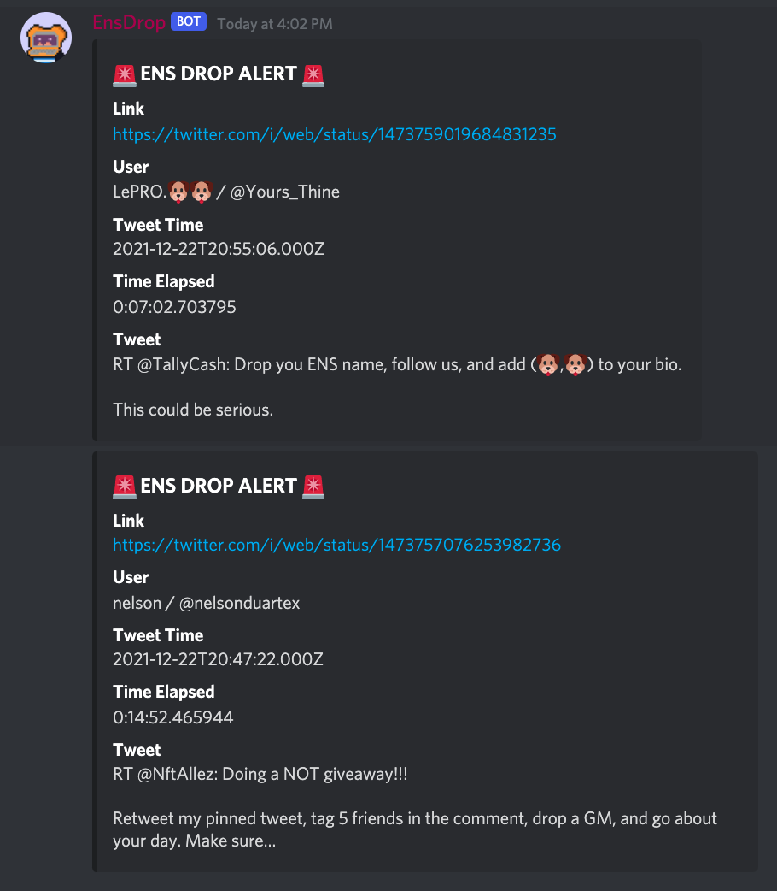

# ens_drop_bot

Special Thanks to @drakedanner for the inspiring this project.

## Configuration

The bot relies on the Twitter API. 
The BEARER_TOKEN field must be present for the bot to function. 
A bearer token can be obtained by signing up for a Twitter Developer Account (FREE).  

DS_TOKEN refers to the Discord Bot Token used for auth. 
CHANNEL_ID refers to the Channel Id that the bot will send messages to. 

Lastly, the bot stores the tweet data in a mongodb cache. 
My mongo configuration is named 'ens_drop_daily' for the database and 'tweet_24hr' for the collection. 

## Usage
./ens_bot.py -c [config]

## EX: 
./ens_bot.py -c ../etc/config.xml

     

